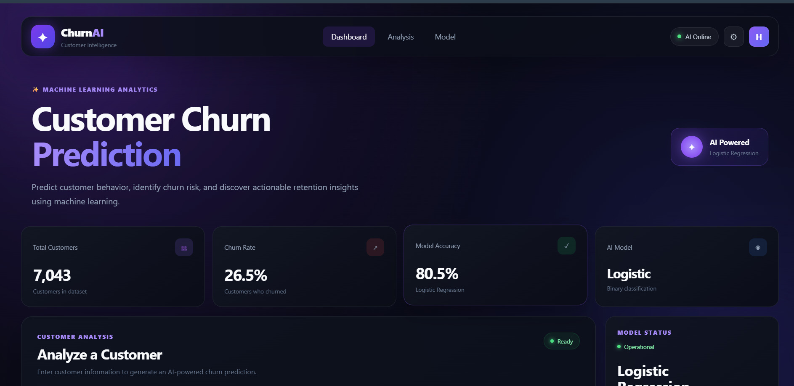
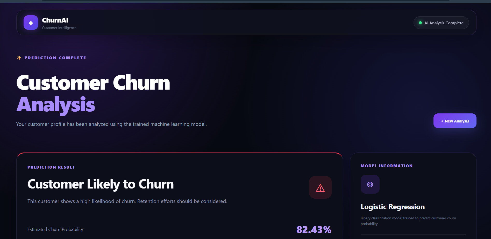
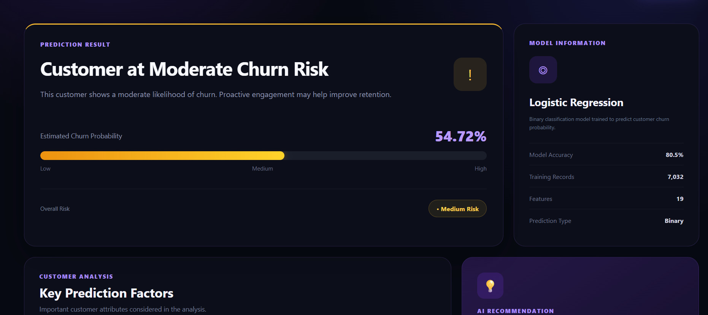
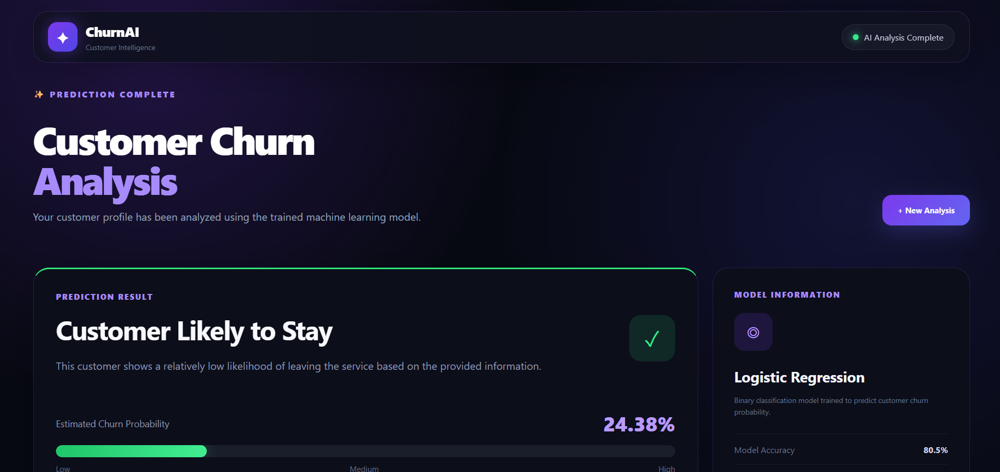
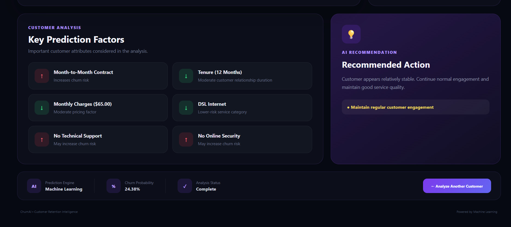

# Customer Churn Prediction System

A machine learning-based web application that predicts whether a customer is likely to churn and provides an estimated churn probability, risk level, key prediction factors, and recommended retention action.

The project was developed as part of an Artificial Intelligence internship and demonstrates the complete workflow from data preprocessing and model training to web-based prediction.

---

## 📌 Project Overview

Customer churn refers to the situation where a customer stops using a company's products or services.

Predicting customer churn in advance can help businesses identify high-risk customers and take appropriate retention actions.

This project uses machine learning to analyze customer information and estimate the probability of churn.

The trained model is integrated into a Flask web application where users can enter customer details and receive an instant prediction.

---

## 🎯 Objectives

- Predict whether a customer is likely to churn.
- Calculate the estimated probability of customer churn.
- Classify customers into Low, Medium, or High risk.
- Identify important customer attributes associated with the prediction.
- Provide an AI-based recommendation for customer retention.
- Compare different machine learning classification models.
- Deploy the trained model inside a web application.

---

## ✨ Features

### Machine Learning

- Data cleaning and preprocessing
- Numerical feature scaling
- Categorical feature encoding
- Train-test split with stratification
- Logistic Regression
- Random Forest Classifier
- Model performance comparison
- Automatic selection of the model with the better F1-score
- Saved trained model using Joblib

### Web Application

- Modern dark-themed user interface
- Customer information input form
- Real-time churn prediction
- Churn probability percentage
- Risk classification
- Key prediction factors
- AI-based retention recommendation
- Responsive design
- Can be accessed from other devices on the same local network

---

## 🛠️ Technology Stack

| Technology | Purpose |
|------------|---------|
| Python | Programming language |
| Pandas | Data processing |
| NumPy | Numerical operations |
| Scikit-learn | Machine learning |
| Joblib | Model serialization |
| Flask | Backend web framework |
| HTML | Web page structure |
| CSS | User interface styling |
| JavaScript | Frontend interactions |
| Matplotlib | Data visualization |
| Seaborn | Data visualization |

---

## 📂 Project Structure

```text
Customer-Churn-Prediction/
│
├── dataset/
│   └── customer_churn.csv
│
├── model/
│   └── churn_model.pkl
│
├── screenshots/
│
├── static/
│   ├── css/
│   │   └── style.css
│   └── js/
│       └── script.js
│
├── templates/
│   ├── index.html
│   └── result.html
│
├── venv/
│
├── .gitignore
├── app.py
├── README.md
├── requirements.txt
└── train_model.py
---

---

## 📸 Screenshots

### 🖥️ Home Page

The main dashboard allows users to enter customer information and submit it for churn prediction.



---

### 🔴 High-Risk Customer

Example prediction showing a high churn probability of 82.43%.



---

### 🟡 Medium-Risk Customer

Example prediction showing a moderate churn probability of 54.72%.



---

### 🟢 Low-Risk Customer

Example prediction showing a low churn probability of 24.38%.



---

### 🔍 Key Prediction Factors

The application highlights important customer attributes considered during the analysis and provides an AI-based recommendation.



---

### 📁 Project Structure

The project is organized into separate folders for the dataset, trained model, frontend assets, templates, and application code.

